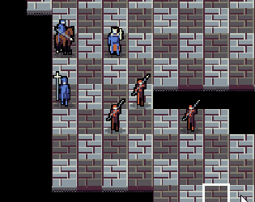

# King's Conquest

**Play the game at itch.io:** https://teamkalamakkara.itch.io/kings-conquest

**King's Conquest** is a chess roguelike game, where you advance through several randomly generated floors until you reach floor 12 where you must defeat the enemy king. The game was made during [7 Day Roguelike Challenge 2023](https://itch.io/jam/7drl-challenge-2023).

The game was made using [Rust](https://www.rust-lang.org/) and [macroquad](https://macroquad.rs/) and the source code is a glorious spaghetti mess full of last minute changes.

[assets/CompassPro.ttf](assets/CompassPro.ttf) is a free font by [somepx](https://somepx.itch.io/humble-fonts-free) and [gl.js](gl.js) is a copy of macroquad's [mq_js_bundle.js](https://github.com/not-fl3/macroquad/blob/ac822a495118eb257a1e817b31c37e20de884657/js/mq_js_bundle.js).
